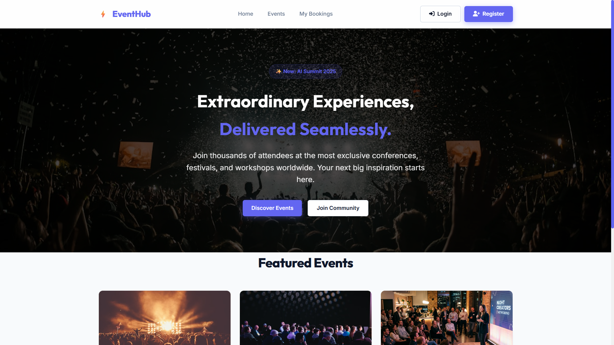
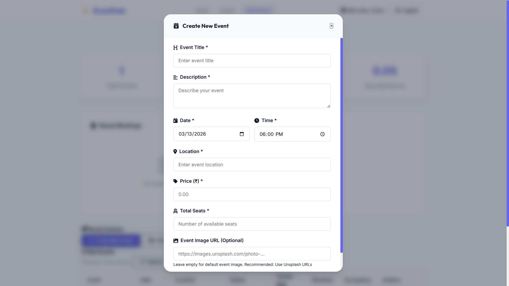
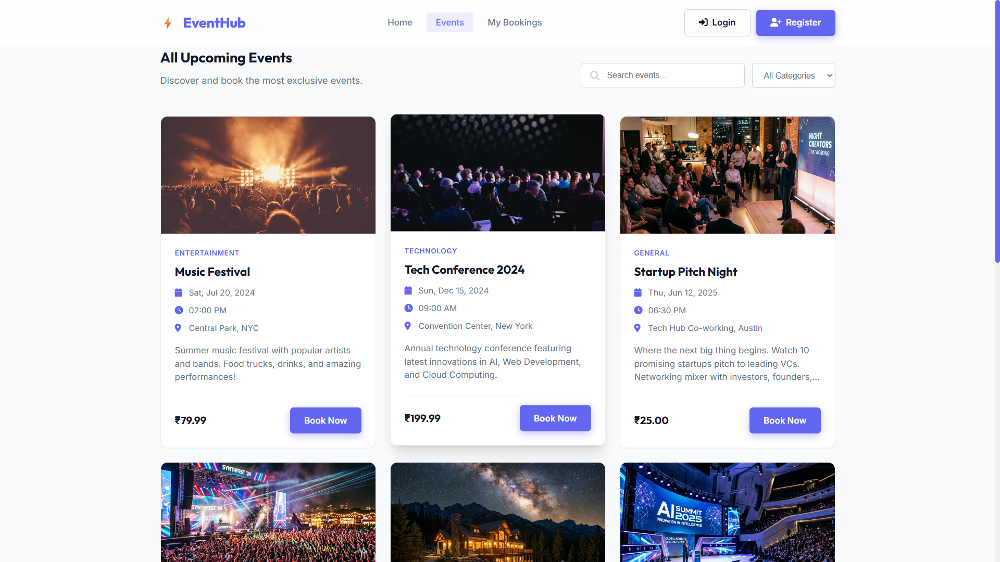
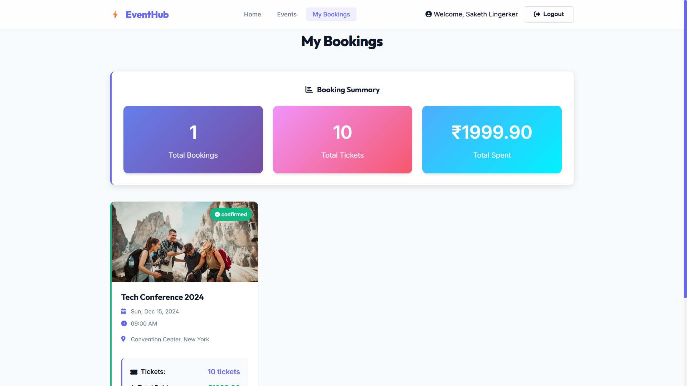
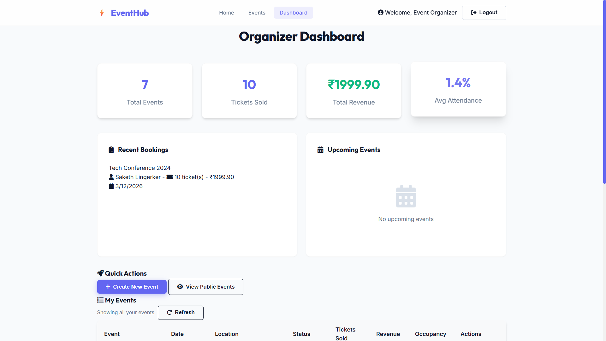
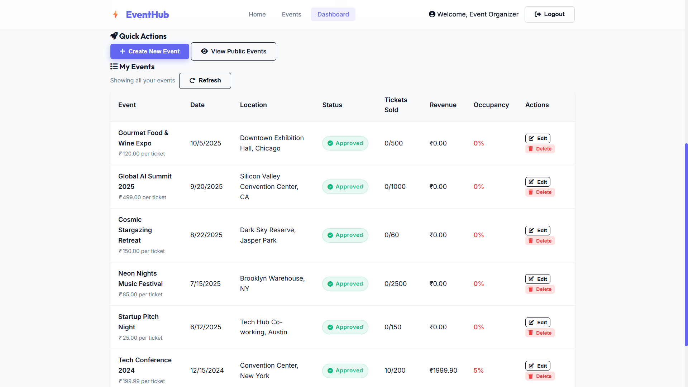
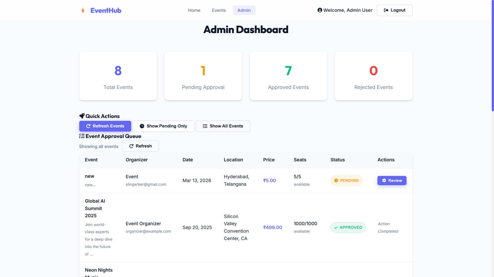
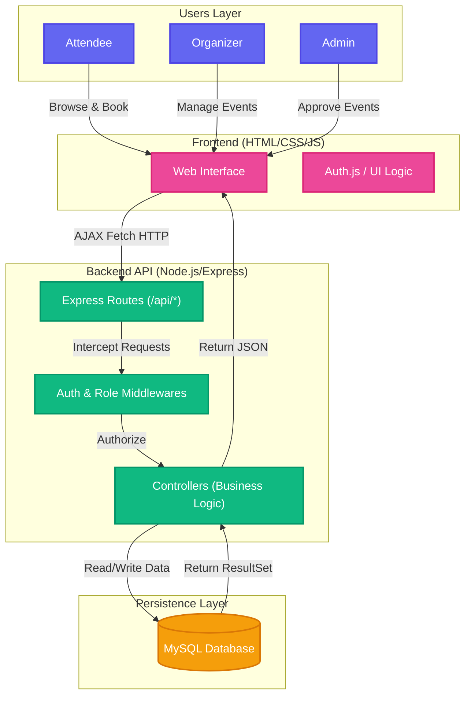
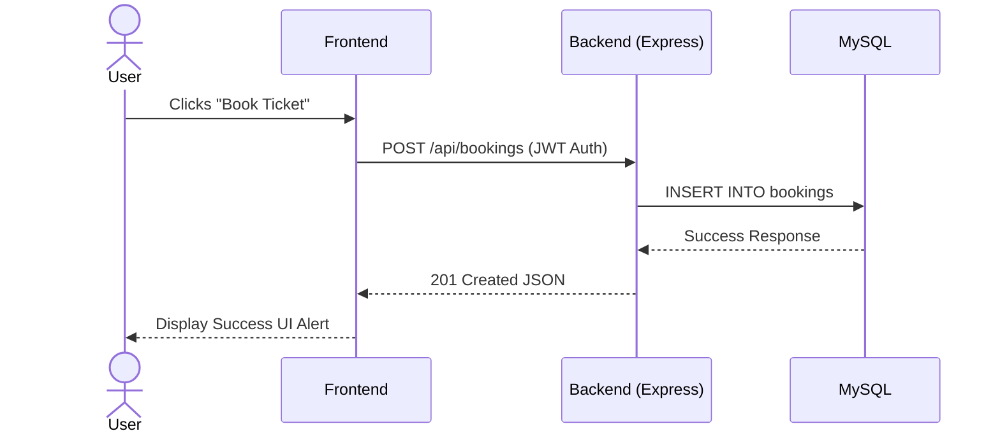

# Online Event Booking and Management System

A full-stack web application designed to help users discover, book, and manage online events easily. This project has been structured using the MVC (Model-View-Controller) architecture to make it highly scalable and maintainable.

## 🌟 Key Features
- **User Authentication:** Secure login, registration, and role-based access control (User, Organizer, Admin).
- **Event Discovery & Booking:** Browse upcoming events and book tickets easily.
- **Organizer Dashboard:** Organizers can create, edit, manage events, and view attendee statistics/revenue.
- **Admin Dashboard:** Administrators can oversee operations, approve or reject events created by organizers, and manage platform integrity.
- **RESTful API:** modularly structured Express API handling business logic securely.

## 🛠️ Tech Stack
- **Frontend:** HTML, CSS, JavaScript (Vanilla API Integration)
- **Backend:** Node.js, Express.js
- **Database:** MySQL
- **Security:** bcryptjs (password hashing), express-session (cookie sessions)
- **Environment Management:** dotenv

## 📁 File Structure

```text
├── src/
│   ├── config/              # Configuration (Database connection handling)
│   │   └── db.js            
│   ├── middleware/          # Express Middlewares (Authentication guards)
│   │   └── auth.js          
│   ├── controllers/         # Business logic decoupled from routes
│   │   ├── adminController.js
│   │   ├── authController.js
│   │   ├── bookingController.js
│   │   ├── eventController.js
│   │   └── organizerController.js
│   └── routes/              # Express API Route definitions
│       ├── adminRoutes.js
│       ├── authRoutes.js
│       ├── bookingRoutes.js
│       ├── eventRoutes.js
│       └── organizerRoutes.js
├── public/                  # Static frontend files (HTML/CSS/JS)
├── scripts/                 # Utility scripts (Seeding, SQL Dump, DB Init)
├── server.js                # Application entry point
├── package.json             # NPM dependencies
└── README.md                # Documentation
```

## 🚀 Setup Instructions (Local Development)

### 1. Prerequisites
- [Node.js](https://nodejs.org/) (v16+ recommended)
- [MySQL](https://www.mysql.com/) server running locally

### 2. Demo User Credentials
If deploying or showcasing the app, the seed script automatically generates the following demo accounts (password is `password123` for all):
- **Admin**: `admin@eventhub.com`
- **Organizer**: `organizer@eventhub.com`
- **User**: `user@eventhub.com`

### 3. Installation
Clone the repository and install dependencies:
```bash
npm install
```

### 3. Environment Variables
Create a `.env` file in the root directory and add the following context (adjust to your local DB):
```env
PORT=3000
DB_HOST=localhost
DB_PORT=3306
DB_USER=your_db_username
DB_PASSWORD=your_db_password
DB_NAME=online_events
SESSION_SECRET=your_super_secret_key
```

### 4. Running the Application
During the first run, the server will automatically connect to your database and create all necessary tables and sample data.
```bash
# Start server
npm start

# OR Start with live reload (needs nodemon)
npm run dev
```
Visit `http://localhost:3000` in your browser.

## 🌐 Deployment Guide (Online)

This application is ready to be deployed to popular PaaS platforms like Render, Railway, or Heroku. Here is a guide for **Render & Aiven/PlanetScale (MySQL Database)**:

### Step 1: Set up an Online MySQL Database
Since free platforms like Render don't host MySQL natively for free, use a provider like **Aiven**, **PlanetScale**, or **Railway**.
1. Create a MySQL database and retrieve your connection details (Host, Port, User, Password, DB Name).

### Step 2: Deploy Backend to Render
1. Push your repository to GitHub.
2. Go to [Render](https://render.com/), click "New" -> "Web Service".
3. Connect your GitHub repository.
4. Set the Build Command to: `npm install`
5. Set the Start Command to: `npm start`
6. Open **Environment Variables** in Render and add the credentials from Step 1:
   - `DB_HOST`: Your remote MySQL host
   - `DB_PORT`: Commonly `3306`, or provided by host
   - `DB_USER`: Your remote username
   - `DB_PASSWORD`: Your remote password
   - `DB_NAME`: Your remote database name
   - `SESSION_SECRET`: A secure random string
7. Click **Deploy**. The platform will fetch your code, run `npm install`, and start the app natively.

Once running, the app will automatically run `initializeDatabase()` and populate your remote DB with tables and demo data.

---

## 📸 App Gallery

Here are some glimpses of the application interface:

### 🏠 Home & Events




### 👤 User & Dashboard Views





---

## 📊 System Architecture Flow

The application follows a standard layered architecture, separating concerns across the Client, API, and the Persistence Layer.



### Data Flow Example

